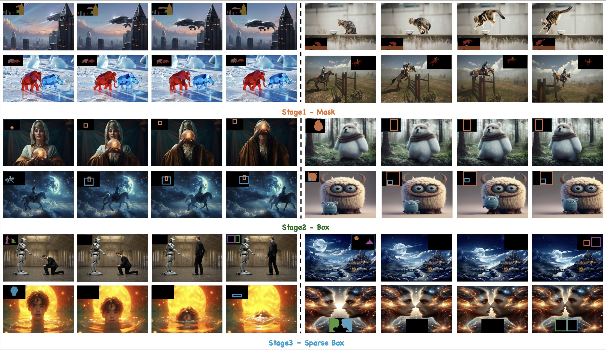

<div align="center">


<br>
<a href="https://arxiv.org/pdf/2412.03859"></a>
<a href="https://quanhaol.github.io/magicmotion-site/"></a>
<a href='https://quanhaol.github.io/magicmotion-site/'></a>
<a href="https://github.com/quanhaol/MagicMotion"></a>
<a href="https://huggingface.co/quanhaol/MagicMotion"></a>
<a href="https://huggingface.co/quanhaol/MagicMotion"></a>
<a href="https://huggingface.co/quanhaol/MagicMotion"></a>

> **MagicMotion: Controllable Video Generation with Dense-to-Sparse Trajectory Guidance**
> [Quanhao Li\*](https://github.com/quanhaol), [Xing Zhen\*](https://chenhsing.github.io/), [Rui Wang](https://scholar.google.com/citations?user=116smmsAAAAJ&hl=en), [Hui Zhang](https://huizhang0812.github.io/), [Qi Dai](https://daiqi1989.github.io/), and [Zuxuan Wu](https://zxwu.azurewebsites.net/)
\* equal contribution

## 💡 Abstract

Recent advances in video generation have led to remarkable improvements in visual quality and temporal coherence. Upon this, trajectory-controllable video generation has emerged to enable precise object motion control through explicitly defined spatial paths.
However, existing methods struggle with complex object movements and multi-object motion control, resulting in imprecise trajectory adherence, poor object consistency, and compromised visual quality.
Furthermore, these methods only support trajectory control in a single format, limiting their applicability in diverse scenarios.
Additionally, there is no publicly available dataset or benchmark specifically tailored for trajectory-controllable video generation, hindering robust training and systematic evaluation.
To address these challenges, we introduce **MagicMotion**, a novel image-to-video generation framework that enables trajectory control through three levels of conditions from dense to sparse: masks, bounding boxes, and sparse boxes. Given an input image and trajectories, MagicMotion seamlessly animates objects along defined trajectories while maintaining object consistency and visual quality.
Furthermore, we present **MagicData**, a large-scale trajectory-controlled video dataset, along with an automated pipeline for annotation and filtering.
We also introduce **MagicBench**, a comprehensive benchmark that assesses both video quality and trajectory control accuracy across different numbers of objects.
Extensive experiments demonstrate that MagicMotion outperforms previous methods across various metrics.

## 📣 Updates

- `2025/03/18` 🔥🔥We released MagicMotion, including inference code and model weights.

## 📑 Table of Contents

- [💡 Abstract](#-abstract)
- [📣 Updates](#-updates)
- [📑 Table of Contents](#-table-of-contents)
- [✅ TODO List](#-todo-list)
- [🐍 Installation](#-installation)
- [📦 Model Weights](#-model-weights)
  - [Folder Structure](#folder-structure)
  - [Download Links](#download-links)
- [🔄 Inference](#-inference)
- [🤝 Acknowledgements](#-acknowledgements)
- [📚 Citation](#-citation)

## ✅ TODO List

- [x] Release our inference code and model weights
- [ ] Release our training code
- [ ] Release MagicData
- [ ] Release MagicBench

## 🐍 Installation

```bash
# Clone this repository.
git clone https://github.com/quanhaol/MagicMotion
cd MagicMotion
# Install requirements
conda create -n magicmotion python==3.10
conda activate magicmotion
pip install -r requirements.txt
pip install git+https://github.com/huggingface/diffusers
```

## 📦 Model Weights

### Folder Structure

```
MagicMotion
└── ckpts
    ├── stage1
    │   ├── mask.pt
    ├── stage2
    │   └── box.pt
    │   └── box_perception_head.pt
    ├── stage3
    │   └── sparse_box.pt
    │   └── sparse_box_perception_head.pt
```

### Download Links

```bash
pip install "huggingface_hub[hf_transfer]"
HF_HUB_ENABLE_HF_TRANSFER=1 huggingface-cli download quanhaol/MagicMotion --local-dir ckpts
```

## 🔄 Inference

It requires around 55 GiB GPU memory tested on NVIDIA A100.

```bash
# Inference script of each stage
bash magicmotion/scripts/inference/inference_mask.sh
bash magicmotion/scripts/inference/inference_box.sh
bash magicmotion/scripts/inference/inference_sparse_box.sh
```

## 🤝 Acknowledgements

We would like to express our gratitude to the following open-source projects that have been instrumental in the development of our project:

- [CogVideo](https://github.com/THUDM/CogVideo): An open source video generation framework by THUKEG.
- [Open-Sora](https://github.com/hpcaitech/Open-Sora): An open source video generation framework by HPC-AI Tech.
- [finetrainers](https://github.com/a-r-r-o-w/finetrainers): A Memory-optimized training library for diffusion models.

Special thanks to the contributors of these libraries for their hard work and dedication!

## 📚 Citation

```bibtex
@misc{zhang2024toratrajectoryorienteddiffusiontransformer,
      title={Tora: Trajectory-oriented Diffusion Transformer for Video Generation},
      author={Zhenghao Zhang and Junchao Liao and Menghao Li and Zuozhuo Dai and Bingxue Qiu and Siyu Zhu and Long Qin and Weizhi Wang},
      year={2024},
      eprint={2407.21705},
      archivePrefix={arXiv},
      primaryClass={cs.CV},
      url={https://arxiv.org/abs/2407.21705},
}
```
