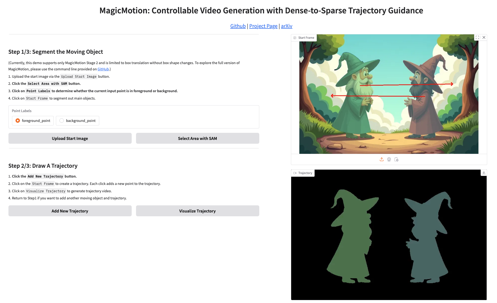
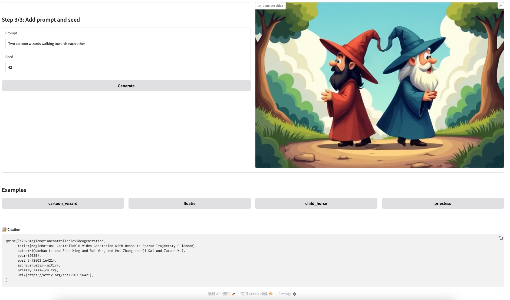

<br>
<a href="https://arxiv.org/pdf/2503.16421"></a>
<a href="https://quanhaol.github.io/magicmotion-site/"></a>
<a href="https://huggingface.co/quanhaol/MagicMotion"></a>

> **MagicMotion: Controllable Video Generation with Dense-to-Sparse Trajectory Guidance**
> <br>
> [Quanhao Li\*](https://github.com/quanhaol), [Zhen Xing\*](https://chenhsing.github.io/), [Rui Wang](https://scholar.google.com/citations?user=116smmsAAAAJ&hl=en), [Hui Zhang](https://huizhang0812.github.io/), [Qi Dai](https://daiqi1989.github.io/), and [Zuxuan Wu](https://zxwu.azurewebsites.net/)
> <br>
\* equal contribution

## 💡 Abstract

Recent advances in video generation have led to remarkable improvements in visual quality and temporal coherence. Upon this, trajectory-controllable video generation has emerged to enable precise object motion control through explicitly defined spatial paths.
However, existing methods struggle with complex object movements and multi-object motion control, resulting in imprecise trajectory adherence, poor object consistency, and compromised visual quality.
Furthermore, these methods only support trajectory control in a single format, limiting their applicability in diverse scenarios.
Additionally, there is no publicly available dataset or benchmark specifically tailored for trajectory-controllable video generation, hindering robust training and systematic evaluation.
To address these challenges, we introduce **MagicMotion**, a novel image-to-video generation framework that enables trajectory control through three levels of conditions from dense to sparse: masks, bounding boxes, and sparse boxes. Given an input image and trajectories, MagicMotion seamlessly animates objects along defined trajectories while maintaining object consistency and visual quality.
Furthermore, we present **MagicData**, a large-scale trajectory-controlled video dataset, along with an automated pipeline for annotation and filtering.
We also introduce **MagicBench**, a comprehensive benchmark that assesses both video quality and trajectory control accuracy across different numbers of objects.
Extensive experiments demonstrate that MagicMotion outperforms previous methods across various metrics.


## 📣 Updates
- `2025/03/28` 🔥🔥We released interactive demo with gradio for MagicMotion.
- `2025/03/27` MagicMotion can now perform inference on a single 4090 GPU (with less than 24GB of GPU memory).
- `2025/03/21` 🔥🔥We released MagicMotion, including inference code and model weights.

## 📑 Table of Contents

- [💡 Abstract](#-abstract)
- [📣 Updates](#-updates)
- [📑 Table of Contents](#-table-of-contents)
- [✅ TODO List](#-todo-list)
- [🐍 Installation](#-installation)
- [📦 Model Weights](#-model-weights)
  - [Folder Structure](#folder-structure)
  - [Download Links](#download-links)
- [🔄 Inference](#-inference)
  - [Scripts](#scripts)
- [🖥️ Gradio Demo](#️-gradio-demo)
- [🤝 Acknowledgements](#-acknowledgements)
- [📚 Contact](#-contact)

## ✅ TODO List

- [x] Release our inference code and model weights
- [x] Release gradio demo
- [ ] Release our training code
- [ ] Release MagicData
- [ ] Release MagicBench

## 🐍 Installation

```bash
# Clone this repository.
git clone https://github.com/quanhaol/MagicMotion
cd MagicMotion

# Install requirements
conda env create -n magicmotion --file environment.yml
conda activate magicmotion
pip install git+https://github.com/huggingface/diffusers

# Install Grounded_SAM2
cd trajectory_construction/Grounded_SAM2
pip install -e .
pip install --no-build-isolation -e grounding_dino

# Optional: For image editing
pip install git+https://github.com/huggingface/image_gen_aux
```

## 📦 Model Weights

### Folder Structure

```
MagicMotion
└── ckpts
    ├── stage1
    │   ├── mask.pt
    ├── stage2
    │   └── box.pt
    │   └── box_perception_head.pt
    ├── stage3
    │   └── sparse_box.pt
    │   └── sparse_box_perception_head.pt
```

### Download Links

```bash
pip install "huggingface_hub[hf_transfer]"
HF_HUB_ENABLE_HF_TRANSFER=1 huggingface-cli download quanhaol/MagicMotion --local-dir ckpts
```

## 🔄 Inference
Inference requires **only 23GB of GPU memory** (tested on a single 24GB NVIDIA GeForce RTX 4090 GPU).  
If you have sufficient GPU memory, you can modify `magicmotion/inference.py` to improve runtime performance:

```python
# Optimized setting (for GPUs with sufficient memory)
pipe.to("cuda")
# pipe.enable_sequential_cpu_offload()
```
> **Note**: Using the optimized setting can reduce runtime by up to 2x.

### Scripts
```bash
# Demo inference script of each stage (Input Image & Trajectory already provided)
bash magicmotion/scripts/inference/inference_mask.sh
bash magicmotion/scripts/inference/inference_box.sh
bash magicmotion/scripts/inference/inference_sparse_box.sh

# You an also construct trajectory for each stage by yourself -- See MagicMotion/trajectory_construction for more details
python trajectory_construction/plan_mask.py
python trajectory_construction/plan_box.py
python trajectory_construction/plan_sparse_box.py

# Optional: Use FLUX to generate input image by text-to-image generation or image editing -- See MagicMotion/first_frame_generation for more details
python first_frame_generation/t2i_flux.py
python first_frame_generation/edit_image_flux.py
```
## 🖥️ Gradio Demo

Usage:

```bash
bash magicmotion/scripts/app/app.sh
```
 

## 🤝 Acknowledgements

We would like to express our gratitude to the following open-source projects that have been instrumental in the development of our project:

- [CogVideo](https://github.com/THUDM/CogVideo): An open source video generation framework by THUKEG.
- [Open-Sora](https://github.com/hpcaitech/Open-Sora): An open source video generation framework by HPC-AI Tech.
- [finetrainers](https://github.com/a-r-r-o-w/finetrainers): A Memory-optimized training library for diffusion models.

Special thanks to the contributors of these libraries for their hard work and dedication!

## 📚 Contact

If you have any suggestions or find our work helpful, feel free to contact us

Email: liqh24@m.fudan.edu.cn or zhenxingfd@gmail.com

If you find our work useful, <b>please consider giving a star to this github repository and citing it</b>:

```bibtex
@article{li2025magicmotion,
  title={MagicMotion: Controllable Video Generation with Dense-to-Sparse Trajectory Guidance},
  author={Li, Quanhao and Xing, Zhen and Wang, Rui and Zhang, Hui and Dai, Qi and Wu, Zuxuan},
  journal={arXiv preprint arXiv:2503.16421},
  year={2025}
}
```
